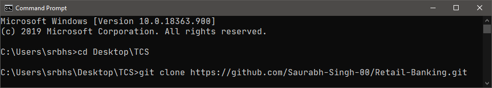
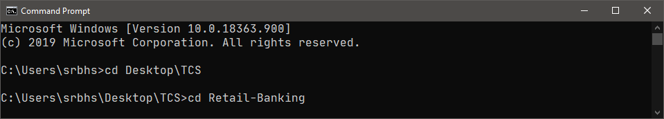
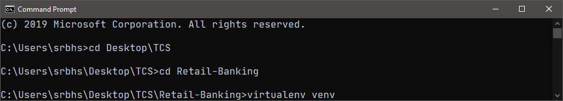
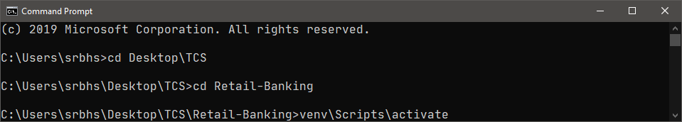
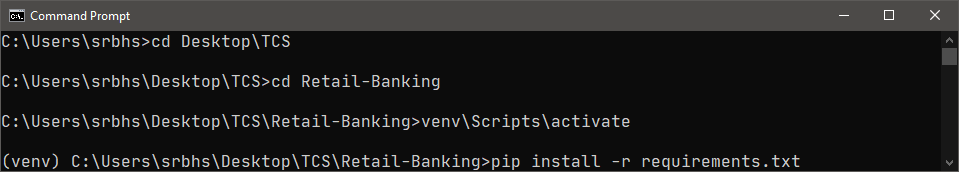
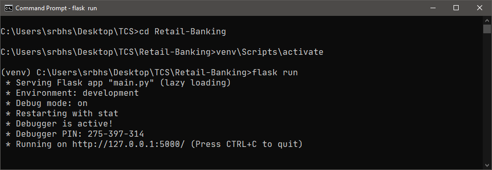

### Retail Banking Project

This is a flask app for Retail Banking System.

##### Project Setup
- Fork this Project First
- Open Command Prompt
- Navigate to the repository you want to clone your project. Eg: `cd Desktop`
- Clone your forked repository `git clone https://github.com/<YOUR-GITHUB-USERNAME>/Retail-Banking.git`

- Navigate to this repository `cd Retail-Banking`

- Create virtual environment `virtualenv venv`

- Activate virtual environment `venv\Scripts\activate`

- Install project dependencies `pip install -r requirements.txt`

##### Run Project
- `flask run`

##### Contribution
- After pushing code to your forked repository please open a Pull Request.